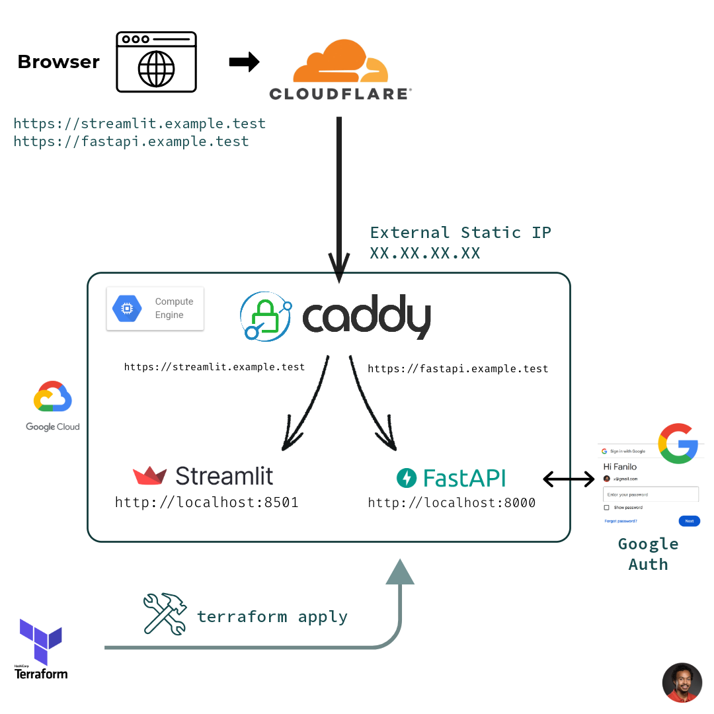
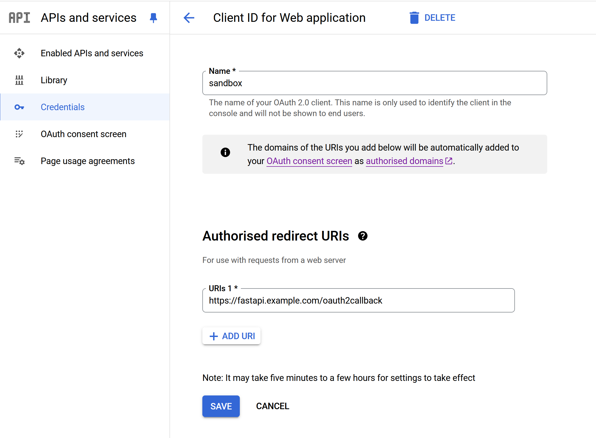
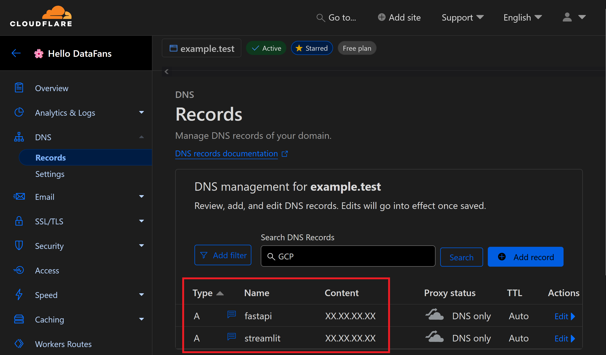
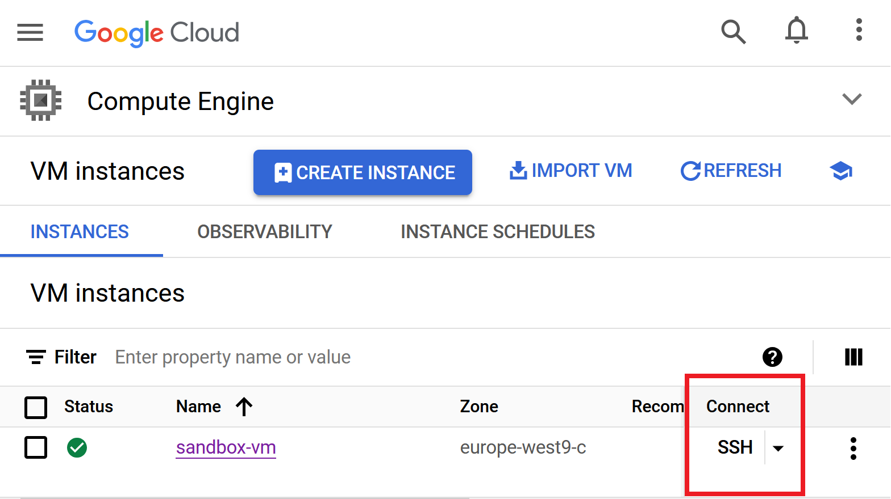

# Streamlit Google Authentication with FastAPI + Access token in Cookie

> **All in GCP Compute Engine (Terraform version)**



_Disclaimer: This is a proof-of-concept for preserving Google user login in Streamlit 1.37+ using cookies. I haven't 100% verified the security+legal best practices for storing access_tokens in a HTTP-only secure cookie, please double-check with your respective teams._

## Create OAuth 2 Credentials in GCP

Head to [GCP Console](https://console.cloud.google.com/), use a GCP Project with billing enabled.

- In **APIs and services > OAuth consent screen**:

  - configure email, links on first page.
  - in Scopes second page, add OpenID Connect scopes: `openid`, `../auth/userinfo.profile` and `.../auth/userinfo.email`.
    - If you enabled the `Calendar API` (either by typing it in search bar or from **APIs and services >Enabled APIs and Services**), add the `.../auth/calendar.events.readonly` to ask the user for Calendar authorization


- add tests users in 3rd page

- In **APIs and services > Credentials**, create a OAuth 2.0 Web Client ID and download it as a JSON file `client_secret.json` to the root of the project. We will copy it later to the VM.
  - As authorised redirect URIs, I added `https://fastapi.example.test/oauth2callback`, our own FastAPI callback endpoint.



## Generate GCP Infrastructure with Terraform

`gcloud` and `terraform` should be installed. Actually you could do this in Cloud Shell as long as you clone the project.

Create `terraform/terraform.tfvars` for project metadata with the following content:

```
project_id = "PROJECT-ID"
region     = "REGION"
zone       = "ZONE"
machine    = "e2-micro"
```

Run the following commands to build infrastructure:

```sh
cd terraform
gcloud auth application-default login
gcloud config set project PROJECT_ID

terraform init
terraform plan
terraform apply
```

The IP for the VM is printed by `terraform output` in `sandbox-vm-web-url` key. Update your DNS records to point your `fastapi.example.test` and `streamlit.example.test` domain names to said IP address. For example in Cloudflare:



## Install Caddy in VM

SSH in VM:



Run the following commands to [install Caddy](https://caddyserver.com/docs/install#debian-ubuntu-raspbian):

```sh
sudo apt update
sudo apt install -y debian-keyring debian-archive-keyring apt-transport-https curl
curl -1sLf 'https://dl.cloudsmith.io/public/caddy/stable/gpg.key' | sudo gpg --dearmor -o /usr/share/keyrings/caddy-stable-archive-keyring.gpg
curl -1sLf 'https://dl.cloudsmith.io/public/caddy/stable/debian.deb.txt' | sudo tee /etc/apt/sources.list.d/caddy-stable.list

sudo apt update
sudo apt install caddy
```

To check Caddy status & logs:

```sh
systemctl status caddy
journalctl -u caddy --no-pager | less +G
```

Edit Caddy configuration in `/etc/caddy/Caddyfile`. Replace domain names accordingly, then reload Caddy proxy:

```sh
sudo tee /etc/caddy/Caddyfile > /dev/null <<EOF
streamlit.example.test {
    reverse_proxy localhost:8501
}

fastapi.example.test {
    reverse_proxy localhost:8000
}
EOF
sudo systemctl restart caddy
```

## Install UV in VM

Run the following command in the VM to [install UV](https://docs.astral.sh/uv/getting-started/installation/): `curl -LsSf https://astral.sh/uv/install.sh | sh`

## Configure App Secrets in VM

Still in the VM, clone project and install dependencies:

```sh
git clone https://github.com/andfanilo/streamlit-fastapi-auth-gcp
uv sync
```

Edit Streamlit secrets with matching `client_id` and `client_secret` from OAuth 2 Client:

```sh
mkdir .streamlit
cat <<EOF > .streamlit/secrets.toml
client_id="XXX.apps.googleusercontent.com"
client_secret="GOCSPX-XXX"
EOF
```

Upload `client_secret.json` to VM:

```sh
cat <<EOF > client_secret.json
{...}
EOF
```

## Run Apps

...I was a little too lazy to put those in an env file, so don't forget to edit `fastapi_server.py` and `streamlit_app.py` for your domain names instead of `example.test`.

I prefer to run Streamlit and FastAPI in 2 separate foreground console:

```sh
uv run -- streamlit run streamlit_app.py
uv run -- fastapi run fastapi_server.py
```

Head to `https://sandbox.example.test` and `https://fastapi.example.test`.

HTTP Ports are also open if you want to debug your apps without going through Caddy HTTPS, by heading to `http://EXTERNAL_IP:8501/` for Streamlit and `http://EXTERNAL_IP:8000/` for FastAPI. You are free to close those firewall ports after debug in the Terraform config.

You may get `Secure Connection Failed` for a few minutes, wait for Caddy to pass the ACME Challenge and download the self-signed certificates.

Check Caddy logs with `journalctl -u caddy --no-pager | less +G`. You may restart caddy `sudo systemctl restart caddy` to reinit the ACME Challenge timer.

Now test Google OAuth login from `https://streamlit.example.test`

## Clean up

When done with demo, to destroy infra: `terraform destroy`

## Resources

- https://cloud.google.com/docs/terraform/create-vm-instance
- https://cloud.google.com/docs/terraform/deploy-flask-web-server
- https://caddyserver.com/docs/running#linux-service
- https://stackoverflow.com/questions/73547776/how-to-redirect-from-one-domain-to-another-and-set-cookies-or-headers-for-the-ot
